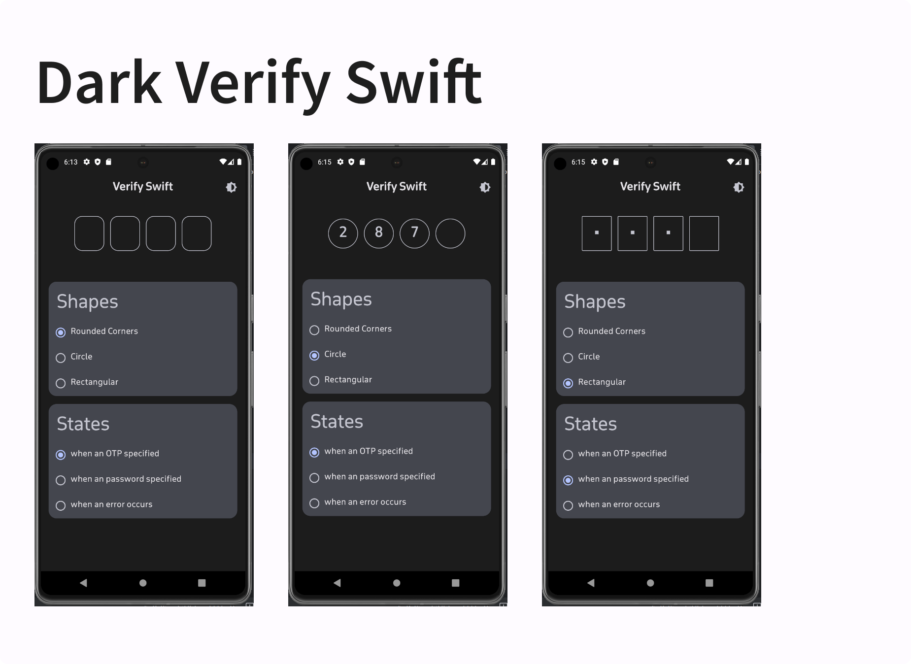
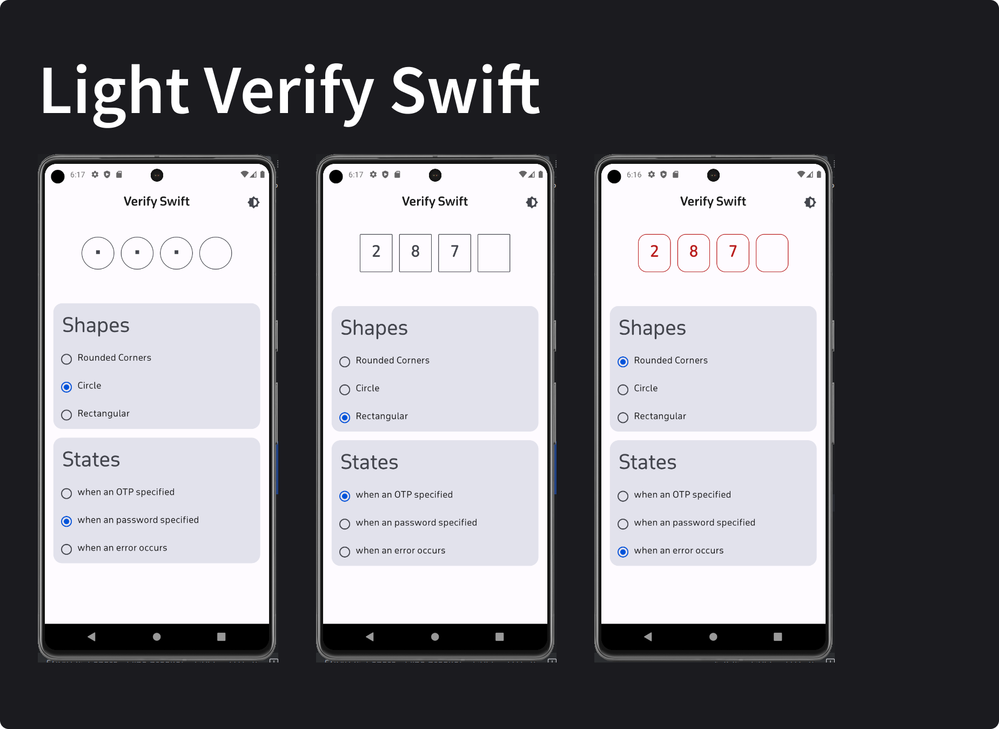

<h1 align="center">Verify Swift</h1></br>
<p align="center">
Check out Verify-Swift! It's a handy tool for adding secure codes to your app. Use it to match passwords or verification codes easily. You can customize it the way you want, and it works for 4 digits or more. Plus, it's made with 100% Kotlin code! Try it for a safer and simpler app experience.
</p>
<br>





## Getting Started
Add it to your root build.gradle at the end of repositories:

```groovy
dependencyResolutionManagement {
		repositoriesMode.set(RepositoriesMode.FAIL_ON_PROJECT_REPOS)
		repositories {
			mavenCentral()
			 maven { url = URI("https://jitpack.io") }
		}
	}
```

Add the dependency

```groovy
dependencies {
	        implementation("com.github.osamasayed585:Verify-Swift:1.0.0")
	}
```
## SwiftAuth Composable

The `SwiftAuth` composable is designed to provide a customizable One-Time Password (OTP) input view in Jetpack Compose.

### Usage Example

```kotlin
@Composable
fun SwiftAuthUsageExample() {
    var otpValue by remember { mutableStateOf("") }

    SwiftAuth(
        otpValue = otpValue,
        onOtpTextChange = { otpValue = it }
    )
}
```


## Customizable Theme Parameters for SwiftAuth Composable

| Parameter             | Description                                                                                                      |
|-----------------------|------------------------------------------------------------------------------------------------------------------|
| `modifier`            | Customizes the appearance and behavior of the SwiftAuth composable. Default sets the background color.           |
| `otpValue`            | Represents the current OTP (One-Time Password) value entered by the user.                                        |
| `onOtpTextChange`     | Callback function invoked when the OTP text changes. Takes the updated OTP string as a parameter.                 |
| `onCompletedNumbers`  | Callback function triggered when the user completes entering the OTP, specified Unit                                            |
| `isError`             | Boolean flag indicating whether an error state should be displayed.                                               |
| `password`            | Boolean flag indicating whether it is visible or not.                                               |
| `enable`              | Boolean flag indicating whether it is enabled or disabled.                                               |
| `pinCount`            | Number of digits in the OTP. Default is 4.                                                                      |
| `containerHeight`     | Height of the container holding the OTP input, specified in Density-independent Pixels (Dp).                      |
| `containerWidth`      | Width of the container holding the OTP input, specified in Density-independent Pixels (Dp).                       |
| `charSize`            | Font size of each character in the OTP input, specified in TextUnits.                                             |
| `containerSpace`      | Space between individual characters in the OTP input, specified in Density-independent Pixels (Dp).             |
| `cornerShape`         | Corner radius of the container holding the OTP input, specified in Density-independent Pixels (Dp).              |
| `outLineChar`         | Enum representing the type of pin view (BORDER, UNDERLINE).                                                            |
| `charErrorColor`      | Color used to indicate errors in the OTP input.                                                                  |
| `charNormalColor`     | Normal color of characters in the OTP input.                                                                     |
| `charBackground`      | Background color of characters in the OTP input.                                                                 |


## Customizable Features for SwiftAuth Composable

The `SwiftAuth` composable offers a range of customizable parameters to tailor the appearance and behavior of the OTP (One-Time Password) input. Developers can take advantage of the following features to integrate and customize `SwiftAuth` within their Jetpack Compose applications:

1. **Custom Number of Pins:**
   - Set the desired number of pins for the OTP input using the `pinCount` parameter.

2. **Hide/Show Input:**
   - Toggle the visibility of the OTP input for secure entry. Utilize the `password` parameter to control visibility.

3. **Custom Pin Height:**
   - Adjust the height of each pin in the OTP input with the `containerHeight` parameter.

4. **Custom Pin Width:**
   - Set the width of the OTP input container using the `containerWidth` parameter.

5. **Custom Pin Size:**
   - Customize the font size of each pin in the OTP input using the `charSize` parameter.

6. **Spacing Between Pins:**
   - Control the spacing between individual pins in the OTP input with the `containerSpace` parameter.

7. **Container Corner Radius:**
   - Adjust the corner radius of the OTP input container for a rounded appearance using the `cornerShape` parameter.

8. **Pin View Style:**
   - Choose the style of the pin view (e.g., bordered or filled) with the `outLineChar` parameter.

9. **Error State Customization:**
   - Customize the appearance of the OTP input in an error state. Adjust the color of characters with the `charErrorColor` parameter.

10. **Normal State Color:**
    - Define the normal state color of characters in the OTP input using the `charNormalColor` parameter.

11. **Background Color:**
    - Customize the background color of characters in the OTP input with the `charBackground` parameter
    
12. **Dark and Light Theme Support:**
    - Seamlessly integrate `SwiftAuth` into applications with support for both dark and light themes. The composable adapts to the theme set in the application, providing a consistent user experience across different themes.

13. **enable/ disable**
    - Boolean flag indicating whether it is enabled or disabled.

These themeable parameters provide developers with the flexibility to seamlessly integrate `SwiftAuth` into their applications while maintaining control over the visual style and user experience.


## License
```xml
MIT License

Copyright (c) 2023 Usama Sayed

Permission is hereby granted, free of charge, to any person obtaining a copy
of this software and associated documentation files (the "Software"), to deal
in the Software without restriction, including without limitation the rights
to use, copy, modify, merge, publish, distribute, sublicense, and/or sell
copies of the Software, and to permit persons to whom the Software is
furnished to do so, subject to the following conditions:

The above copyright notice and this permission notice shall be included in all
copies or substantial portions of the Software.

THE SOFTWARE IS PROVIDED "AS IS", WITHOUT WARRANTY OF ANY KIND, EXPRESS OR
IMPLIED, INCLUDING BUT NOT LIMITED TO THE WARRANTIES OF MERCHANTABILITY,
FITNESS FOR A PARTICULAR PURPOSE AND NONINFRINGEMENT. IN NO EVENT SHALL THE
AUTHORS OR COPYRIGHT HOLDERS BE LIABLE FOR ANY CLAIM, DAMAGES OR OTHER
LIABILITY, WHETHER IN AN ACTION OF CONTRACT, TORT OR OTHERWISE, ARISING FROM,
OUT OF OR IN CONNECTION WITH THE SOFTWARE OR THE USE OR OTHER DEALINGS IN THE
SOFTWARE.
```

